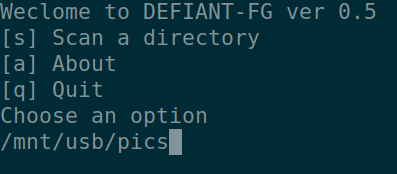

# DEFIANT-FG

## About

DEFIANT-FG (FG) is a light-weight command line utility designed to check file (object) integrity within a directory structure. The hash of the object is stored within a database located within the root of the given directory. You can easily move this file with the directory between computers. Additional files are added to the database at the next run. 

Run periodically to check the integrity of your static archive or backup. New and unknown files are added to the database at next run, so you can easily grow the directory. FG will, however, log failed hashes (such as bit rot or corrupted files) and missing files.  
 
## How it works 

Each object is checked against a known hash. If the object has not been seen by FG yet, a hash will be generated and stored in the database. Further running of the script will result in the object being checked against the hash. Some objects change, you know which are corrupted and need restoring for backup. Many integrity fails informs you that your media is damaged, such as faulted hard drive.  

## What's a hash 

The object (such as picture file, video file, document) is put through a mathematical formula to return a unique code for each object. It's unlikely two different objects will contain the same code. This is why it's a great method to check objects have not been changed. For example, if bit rot occurs, a single bit may change from a 1 to a 0 or vice versa which may not make much difference to a text file, but completely change a picture or damage a video.  

FG uses the SHA-256 algorithm to generate hashes. For example the word "DEFIANT-FG" run through SHA-256 will become: 2948a9654f6276d7de69e60c9304ece662f9ba17c667e6dfcd4dacf38661192b. If I change the last character from "G" to "g" and run again, the hash will completely change: 121089879462d657a7938d8e44b909d6cabfde31f525a13c04be0a534ee61f5e 

## Install and Download

This read me is desgined to be brief to allow you to start enjoying FG as soon as possible. For more detail, please read the [manual](https://karlhunter.co.uk/defiant/man/1). 

## Download

xyz

## Install

### Linux

On Linux, run the install script as root.

	sudo sh INSTALL.sh

This script will copy necessary files so allow you to run in the command line:

	dfg

### Windows

Download and extract latest version. 

Copy to /???

Open PowerShell or CMD

Run to test:

	dfg

## Usage 

Run the command-line too: 

> fg --dir /path/dir/  

You choose a directory to scan. Let's say it's your pictures folder on an external hard drive located /mnt/hdd/Pictures/ 

If you have scanned this directory before, there will be a database file with the hashes. If not present, FG will check for a backup. If not found, a blank database will be created. 

FG will look through the directory structure at every file. If the file is known to FG, the previous hash will be checked against the current hash - if it changes you will be notified to restore from backup. If the file is not known, a new hash will be generated and stored into the database. 

Finally, the database file is used to check for missing files 

## Database File 

This file is portable and should move with the directory, such as back up to remote storage or migration to new hard drive. It contains the path to file, hash of file, and basic meta data.  

## Manual

For more detail, read the manual [here](https://karlhunter.co.uk/defiant/man/).

## Help

If you would like to contribute, please commit changes and I will be happy for the help. Please visit decision for more details and direction of the project. 